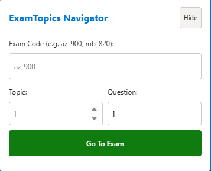
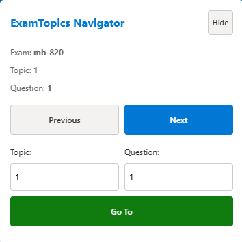
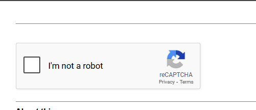
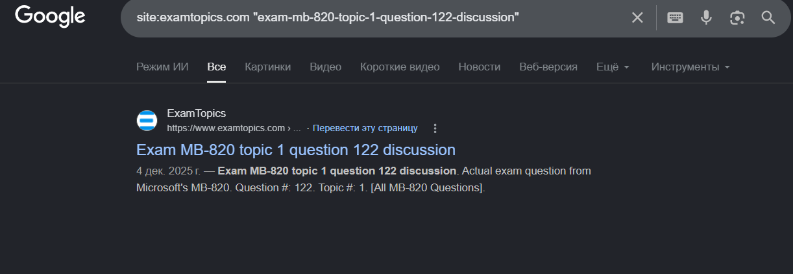
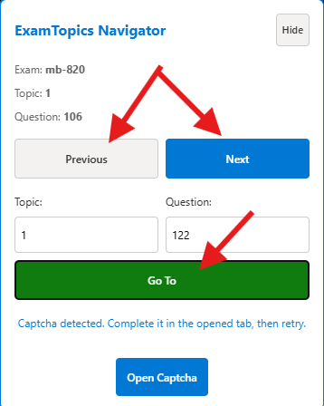

# ExamTopics Navigator

## Summary
ExamTopics Navigator is a Chrome extension that helps you quickly move between ExamTopics questions and topics and jump to a specific exam code, topic, and question.

## Installation (Chrome)
0. Download or clone this repository
1. Open Chrome and go to chrome://extensions
2. Enable Developer mode (top right corner toogle)
3. Click Load unpacked
4. Select this project folder: ExamTopicsExtension
5. Pin the extension (optional) so the popup is easy to access

To update after changes:
> Go to chrome://extensions and click Reload on the extension card

## Usage
### On ExamTopics pages
Open any https://www.examtopics.com page. A small on-page panel is available to navigate.

You can enter Exam Code, Topic, and Question to jump directly. Use Hide to hide the panel and use the small Open button to show it again.

### Using the extension popup
Click the extension icon to open the popup. Use Next and Previous to navigate. Use Go To to open an exact topic and question.

## IMPORTANT
If navigation cannot find a page, Google may require a captcha. Solve it in the opened tab.

Close opened search page.

Try again whatever you clicked.

